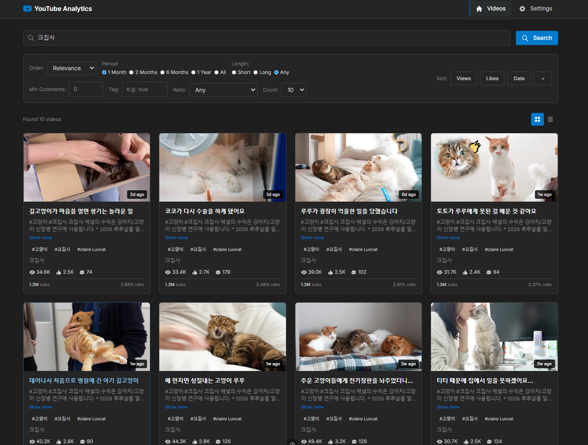

# Social Video Analytics Application

A full-stack video search and analytics platform built with **Nuxt 3** (frontend) and **FastAPI** (backend), featuring a **Visual Studio Code-inspired design**. Supports both **YouTube** and **TikTok** video search and analytics.

## Features

### 🎥 Video Search & Discovery
- **YouTube**: Real-time video search using YouTube Data API v3
- **TikTok**: Video search using RapidAPI TikTok Scraper
- Platform switcher (YouTube/TikTok)
- Advanced filtering (relevance, date, view count, rating)
- Client-side sorting by views, likes, and date
- Adjustable result limits (10, 25, 50)
- Pagination with "Load More" functionality

### 📊 Video Analytics
- View count, like count, and comment count display
- View/Subscriber ratio calculation
- Publication date tracking
- Channel information and subscriber counts

### 🎬 Video Playback
- In-app video player modal
- YouTube iframe integration
- TikTok video support
- Click-to-play functionality

### ⚙️ Settings Management
- YouTube API key configuration
- TikTok RapidAPI key configuration
- Secure key storage in .env file
- API key status monitoring with masked display

### 🎨 VS Code Design Theme
- Dark theme with VS Code color palette
- Activity bar-style navigation
- Status bar footer
- Smooth animations and transitions




## Tech Stack

**Frontend:**
- Nuxt 3
- Vue 3 Composition API
- Tailwind CSS
- Axios

**Backend:**
- FastAPI
- Python 3.8+
- YouTube Data API v3
- Pydantic

## Prerequisites

- Node.js 18+ and npm
- Python 3.8+
- **YouTube Data API v3 key** ([Get one here](https://console.cloud.google.com/))
- **RapidAPI account** (for TikTok support) ([Sign up here](https://rapidapi.com/))
- **TikTok Scraper API subscription** ([Subscribe here](https://rapidapi.com/DataFanatic/api/tiktok-scraper7))

## Installation

### Backend Setup

```bash
# Navigate to backend directory
cd backend

# Create virtual environment (recommended)
python -m venv venv
venv\Scripts\activate  # Windows
# source venv/bin/activate  # macOS/Linux

# Install dependencies
pip install -r requirements.txt

# Create .env file
copy .env.example .env
# Edit .env and add your YouTube API key (optional - can be set via UI)
```

### Frontend Setup

```bash
# Navigate to frontend directory
cd frontend

# Install dependencies
npm install
```

## Running the Application

### Start Backend Server

```bash
cd backend
uvicorn main:app --reload
```

Backend will run at: `http://localhost:8000`
API docs available at: `http://localhost:8000/docs`

### Start Frontend Server

**Option 1: Using the startup script (Recommended for macOS with NVM)**
```bash
cd frontend
./start-dev.sh
```

**Option 2: Using npm directly**
```bash
cd frontend
npm run dev
```

Frontend will run at: `http://localhost:3000`

### Troubleshooting

**If you get "npm: command not found" error:**

This happens when NVM (Node Version Manager) is not properly loaded in your shell. Fix it by adding these lines to your `~/.zshrc` file:

```bash
export NVM_DIR="$HOME/.nvm"
[ -s "$NVM_DIR/nvm.sh" ] && \. "$NVM_DIR/nvm.sh"
```

Then restart your terminal or run:
```bash
source ~/.zshrc
```

Alternatively, use the provided `start-dev.sh` script which handles this automatically.

## Usage

1. **Configure API Keys** (First Time)
   - Navigate to Settings page
   - **YouTube**: Enter your YouTube Data API v3 key and click "Save API Key"
   - **TikTok**: Enter your RapidAPI key and click "Save TikTok API Key"
   - Both keys are optional - configure only the platforms you want to use

2. **Search Videos**
   - Go to the Videos page (home)
   - Select platform (YouTube or TikTok) using the platform switcher
   - Enter search query
   - Adjust filters (order by, max results, date range, etc.)
   - Click "Search"

3. **Sort Results**
   - Use sort buttons (Views, Likes, Date)
   - Toggle sort direction with arrow button
   - Switch between Grid and Table view

4. **Play Videos**
   - Click on any video card
   - Video player modal will open
   - Close with X button or click outside

5. **Load More Results**
   - Scroll to bottom and click "Load More" for pagination

## API Endpoints

### YouTube Videos
- `GET /api/videos/search` - Search YouTube videos
  - Query params: `q`, `maxResults`, `order`, `publishedAfter`, `videoDuration`, `minRatio`, `minComments`, `tag`, `pageToken`
- `GET /api/videos/{video_id}` - Get YouTube video details

### TikTok Videos
- `GET /api/tiktok/search` - Search TikTok videos
  - Query params: `q`, `maxResults`, `order`, `publishedAfter`, `videoDuration`, `minRatio`, `minComments`, `tag`, `pageToken`
- `GET /api/tiktok/{video_id}` - Get TikTok video details

### Settings
- `GET /api/settings/api-key` - Check YouTube API key status
- `POST /api/settings/api-key` - Save YouTube API key
- `DELETE /api/settings/api-key` - Delete YouTube API key
- `GET /api/settings/tiktok-api-key` - Check TikTok API key status
- `POST /api/settings/tiktok-api-key` - Save TikTok API key
- `DELETE /api/settings/tiktok-api-key` - Delete TikTok API key

## Project Structure

```
youtube/
├── backend/
│   ├── main.py              # FastAPI app
│   ├── config.py            # Configuration
│   ├── requirements.txt     # Python dependencies
│   ├── routes/
│   │   ├── youtube.py       # YouTube video endpoints
│   │   ├── tiktok.py        # TikTok video endpoints
│   │   └── settings.py      # Settings endpoints
│   └── services/
│       ├── youtube_service.py    # YouTube API integration
│       ├── tiktok_service.py     # TikTok API integration
│       └── settings_service.py   # Settings management
└── frontend/
    ├── nuxt.config.ts       # Nuxt configuration
    ├── package.json         # Node dependencies
    ├── tailwind.config.js   # Tailwind config
    ├── app.vue              # Root component
    ├── assets/
    │   └── css/
    │       └── main.css     # Global styles (VS Code theme)
    ├── components/
    │   ├── VideoCard.vue    # Video card component
    │   ├── VideoPlayer.vue  # Video player modal
    │   ├── VideoTable.vue   # Table view component
    │   ├── SearchBar.vue    # Search input
    │   └── FilterControls.vue  # Filter/sort controls
    ├── composables/
    │   ├── useYouTubeApi.ts    # YouTube API composable
    │   ├── useTikTokApi.ts     # TikTok API composable
    │   └── useSettings.ts      # Settings composable
    ├── layouts/
    │   └── default.vue      # Default layout
    └── pages/
        ├── index.vue        # Videos page
        └── settings.vue     # Settings page
```

## Design System

The application uses a **Visual Studio Code-inspired design**:

- **Colors:**
  - Background: `#1e1e1e`
  - Sidebar: `#252526`
  - Accent: `#007acc` (blue)
  - Highlight: `#f9826c` (orange)
  - Text: `#cccccc`

- **Typography:** Inter, Segoe UI
- **Components:** Cards, buttons, inputs styled like VS Code
- **Navigation:** Activity bar-style with icons

## API Quotas

### YouTube API
The free tier has a daily quota of **10,000 units**:
- Search request: ~100 units
- Video details: ~1 unit

Approximately **100 searches per day** on free tier.

### TikTok API (RapidAPI)
Quota depends on your RapidAPI subscription plan:
- **Free tier**: Limited requests per month (check TikTok Scraper API pricing)
- **Pro tier**: Higher limits available
- Each search request counts toward your monthly quota

**Note**: Without a TikTok API key configured, the app will display mock data for TikTok searches.

## License

MIT

## Author

Built with Nuxt 3 and FastAPI
